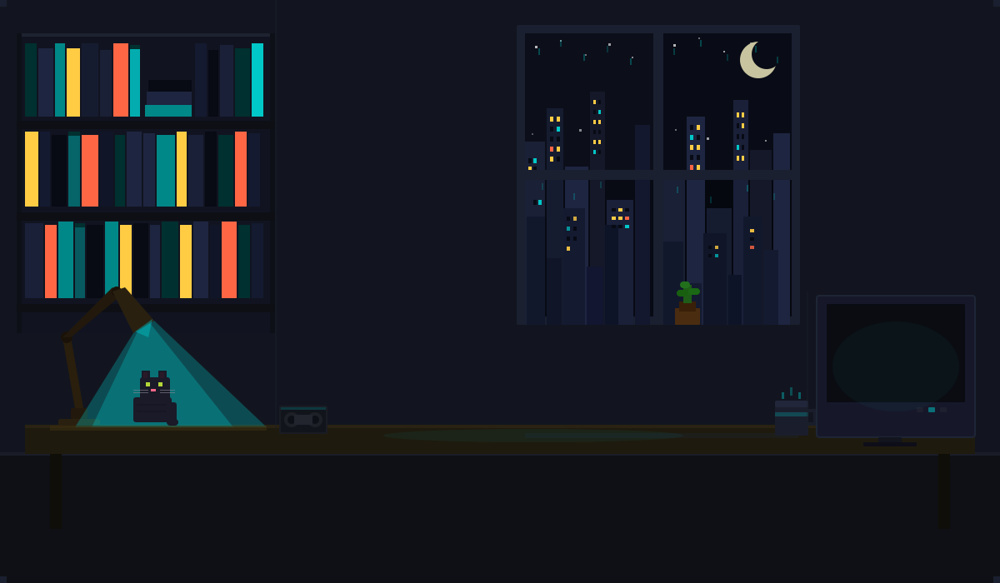

<div align="center">



# Reproductor MP3

**Aplicación de escritorio con estética de tocadiscos retro, desarrollada en Java + JavaFX.**

Proyecto Integrador — Algoritmos y Estructuras de Datos · UNSa 2026

[](https://openjdk.org/)
[](https://openjfx.io/)
[](https://maven.apache.org/)
[](LICENSE)

</div>

---

## ¿Qué es esto?

Un reproductor de archivos MP3 de escritorio construido desde cero en Java. La interfaz imita visualmente un tocadiscos físico vintage con vinilo animado, brazo de aguja mecánico y una paleta de colores que cambia dinámicamente extrayendo los tonos dominantes de la portada del álbum en reproducción.

El requisito académico central fue no usar ninguna colección de la librería estándar de Java (`ArrayList`, `LinkedList`, `HashMap`, etc.). Toda la lógica de almacenamiento y ordenamiento se implementó con estructuras de datos propias construidas desde cero.

---

## Capturas

> *Proximamente*

---

## Características

- Reproducción de archivos MP3 con controles completos: play, pause, siguiente, anterior
- Lectura de metadatos ID3 (título, artista, año, portada del álbum)
- Interfaz de tocadiscos animada con vinilo y brazo mecánico
- Paleta de colores dinámica extraída de la portada del disco en reproducción
- Lista de reproducción con ordenamiento por nombre, artista o año
- Modo shuffle con permutación aleatoria completa (Fisher-Yates)
- Modo loop para repetir la pista actual
- Barra de progreso interactiva con seek en tiempo real
- Soporte de temas claro y oscuro

---

## Tecnologías

| Tecnología | Versión | Uso |
|---|---|---|
| Java | JDK 21+ | Lenguaje principal |
| JavaFX | 22 | Interfaz gráfica (controles, animaciones, WebView) |
| Maven | 3.9+ | Gestión de dependencias y build |
| mp3agic | 0.9.1 | Lectura de metadatos ID3v1/v2 y portadas |
| Color Thief | 1.1.2 | Extracción de paleta de color desde la portada |

---

## Arquitectura

El proyecto sigue el patrón **MVC** con controladores especializados por responsabilidad:

```
controllers/
├── MainController       → Orquesta toda la lógica: reproducción, lista, temas
├── ControlesController  → Botones y slider de progreso; delega eventos al Main
├── TocadiscosController → Animaciones del vinilo y brazo mecánico
└── SvgController        → Motor de renderizado del fondo SVG animado

modelo/
├── datos/               → Entidades del dominio (Canción, Paleta, Listas)
├── criterios/           → Estrategias de ordenamiento intercambiables
├── estructuras/         → Implementaciones de listas enlazadas propias
└── interfaces/          → Contratos que definen las operaciones de cada estructura

ui/
├── ThemeManager         → Aplicación de paletas CSS a la escena
└── ShuffleManager       → Lógica de permutación aleatoria de la cola
```

---

## Estructuras de datos propias

Una de las restricciones del proyecto fue no usar ninguna colección de `java.util`. Todo fue implementado con nodos y punteros:

**`Lista0DLinkedL`** — lista doblemente enlazada base abstracta. Implementa operaciones fundamentales: `insertar`, `eliminar`, `devolver`, `buscar`, `tam`, `limpiar`.

**`Lista1DLinkedL`** — extiende la base con inserción por posición y reemplazo en O(n/2) (recorrido desde el extremo más cercano).

**`Lista2DLinkedL`** — lista ordenada. La inserción ubica automáticamente cada elemento en su posición correcta según un criterio inyectado.

**`NodoDoble`** — nodo con punteros `prev` y `next`, almacena cualquier `Object`.

**`ListaCancion`** — lista de reproducción principal, extiende `Lista1DLinkedL` con igualdad por ruta de archivo.

**`ListaCancionOrdenada`** — lista ordenada de canciones, extiende `Lista2DLinkedL`. Recibe un `CriterioOrdenacion` en su constructor (patrón Strategy).

**`ListaIndices`** — lista de enteros para la cola de shuffle. Permite la implementación de Fisher-Yates sin ninguna colección de Java.

### Patrón Strategy en el ordenamiento

Los criterios de ordenamiento son clases intercambiables que implementan la misma interfaz:

```java
// Se inyecta el criterio en tiempo de ejecución
ListaCancionOrdenada lista = new ListaCancionOrdenada(new PorArtista());

// Cada criterio define su propia comparación
class PorArtista implements CriterioOrdenacion {
    public boolean esMenor(Object a, Object b) { ... }
    public boolean esMayor(Object a, Object b) { ... }
    public boolean iguales(Object a, Object b) { ... }
}
```

### Shuffle con Fisher-Yates sobre lista propia

```java
// Llenamos la ListaIndices con 0..n-1
for (int i = 0; i < tam; i++) colaShuffle.insertar(i, i);

// Fisher-Yates: intercambio aleatorio hacia atrás
for (int i = tam - 1; i > 0; i--) {
    int j = random.nextInt(i + 1);
    Integer valI = (Integer) colaShuffle.devolver(i);
    Integer valJ = (Integer) colaShuffle.devolver(j);
    colaShuffle.reemplazar(valJ, i);
    colaShuffle.reemplazar(valI, j);
}
```

---

## Estructura del proyecto

```
src/
├── main/
│   ├── java/
│   │   ├── controllers/
│   │   │   ├── ControlesController.java
│   │   │   ├── MainController.java
│   │   │   ├── SvgController.java
│   │   │   └── TocadiscosController.java
│   │   ├── modelo/
│   │   │   ├── criterios/
│   │   │   │   ├── CriterioOrdenacion.java
│   │   │   │   ├── PorAnio.java
│   │   │   │   ├── PorArtista.java
│   │   │   │   └── PorNombre.java
│   │   │   ├── datos/
│   │   │   │   ├── Cancion.java
│   │   │   │   ├── ExtractorPaleta.java
│   │   │   │   ├── ListaCancion.java
│   │   │   │   ├── ListaCancionOrdenada.java
│   │   │   │   ├── ListaIndices.java
│   │   │   │   └── Paleta.java
│   │   │   ├── estructuras/
│   │   │   │   ├── Lista0DLinkedL.java
│   │   │   │   ├── Lista1DLinkedL.java
│   │   │   │   ├── Lista2DLinkedL.java
│   │   │   │   └── NodoDoble.java
│   │   │   └── interfaces/
│   │   │       ├── OperacionesCL2.java
│   │   │       ├── OperacionesCL3.java
│   │   │       ├── OperacionesCL4.java
│   │   │       └── ReproductorListener.java
│   │   ├── module-info.java
│   │   ├── reproductor/
│   │   │   └── Main.java
│   │   ├── services/
│   │   │   └── OrdenamientoService.java
│   │   └── ui/
│   │       ├── ShuffleManager.java
│   │       └── ThemeManager.java
│   └── resources/
│       ├── assets/
│       │   └── FONOOO.svg
│       ├── fonts/
│       │   └── PressStart2P-Regular.ttf
│       ├── styles/
│       │   ├── controls.css
│       │   ├── player.css
│       │   ├── playlist.css
│       │   ├── style.css
│       │   └── themes/
│       │       ├── darkTheme.css
│       │       └── lightTheme.css
│       └── views/
│           ├── controles-view.fxml
│           ├── main-view.fxml
│           └── tocadiscos-view.fxml
```

---

## Cómo ejecutar

### Método Automático (Recomendado — Instala dependencias de forma local y automática)

Hemos incluido scripts portables que detectan si tienes Java 21 instalado en el sistema. En caso de no ser así, **descargan una copia local portable de JDK 21** y configuran un wrapper autónomo de Maven. **No necesitas instalar Java ni Maven en tu equipo manualmente.**

#### En Linux y macOS:
1. Abre tu terminal en la carpeta del proyecto.
2. Ejecuta el launcher:
   ```bash
   ./run.sh
   ```

#### En Windows:
1. Abre la carpeta del proyecto.
2. Haz doble clic en el archivo `run.bat` (o ejecútalo desde CMD/PowerShell escribiendo `run.bat`).

---

### Método Manual (Si prefieres usar tus propias herramientas del sistema)

#### Requisitos previos:
- JDK 21 o superior → [descargar](https://adoptium.net/)
- Maven 3.9+ → [descargar](https://maven.apache.org/download.cgi)

#### Desde terminal:
```bash
git clone https://github.com/isauwuu/Reproductor-MP3.git
cd Reproductor-MP3
mvn clean javafx:run
```

#### En IntelliJ IDEA:
1. Abre el IDE, ve a `File → Open` y selecciona la carpeta del proyecto.
2. Deja que el IDE detecte el `pom.xml` y descargue las dependencias.
3. Ejecuta la clase `reproductor.Main`.

---

## Problemas comunes

**"JavaFX runtime components are missing"**
El proyecto no se abrió como proyecto Maven. Cerrar, volver a abrir seleccionando Maven como tipo de proyecto, esperar que cargue y ejecutar `mvn clean install`.

**"Location is not set" al iniciar**
Verificar que exista `src/main/resources/views/main-view.fxml` y que el path en `Main.java` coincida exactamente.

**El vinilo no se anima**
Revisar que `fx:id="viniloContenedor"` y `fx:id="brilloVinilo"` estén presentes en `tocadiscos-view.fxml` y que `TocadiscosController` esté correctamente inyectado.

**Sin audio en Linux**
Algunos entornos de escritorio en Linux tienen problemas con el backend nativo de JavaFX Media. Verificar que GStreamer esté instalado (`gst-plugins-base`, `gst-plugins-good`).

---

## Equipo

Desarrollado por estudiantes de **Tecnicatura Universitaria en Programación — UNSa**, en el marco de la materia **Algoritmos y Estructuras de Datos**, 2026.

---

<div align="center">
<sub>Proyecto académico · Universidad Nacional de Salta · 2026</sub>
</div>
